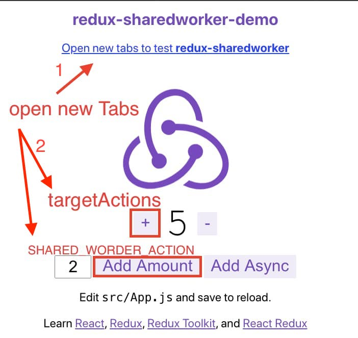
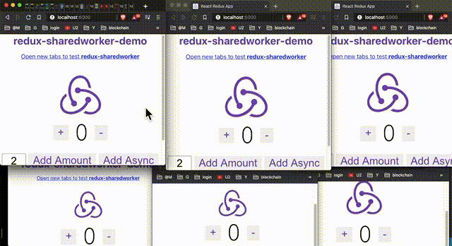

# This repo is [redux-sharedworker](https://github.com/flameddd/redux-sharedworker) demo project
## (Documentation: https://github.com/flameddd/redux-sharedworker)
This demo is based on `@reduxjs/toolkit` project
- https://redux-toolkit.js.org/introduction/quick-start

## clone repo
```bash
git clone https://github.com/flameddd/redux-sharedworker-demo.git
```
## install repo
```bash
cd redux-sharedworker-demo
npm install
```

## launch project
```
npm start
```

then visit `http://localhost:3000/`

## how to test
<p align="center">
  
  
</p>

## about code
### Middleware: `createSharedWorkerMiddleware` and `targetActions`
- https://github.com/flameddd/redux-sharedworker-demo/blob/master/src/app/store.js

### Init: `dispatch({ type: 'SHARED_WORDER_INIT' })`
- https://github.com/flameddd/redux-sharedworker-demo/blob/master/src/App.js#L8-L12

### Action type: `SHARED_WORDER_ACTION`
- https://github.com/flameddd/redux-sharedworker-demo/blob/master/src/features/counter/Counter.js#L47